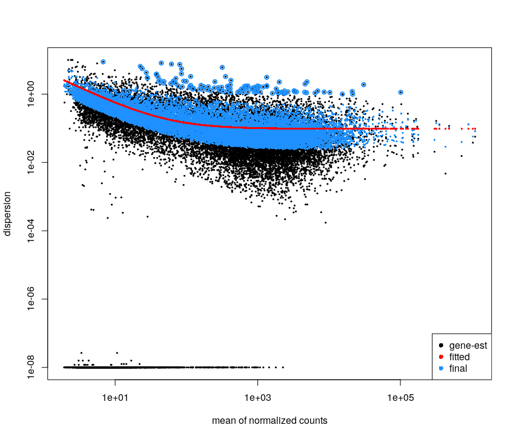
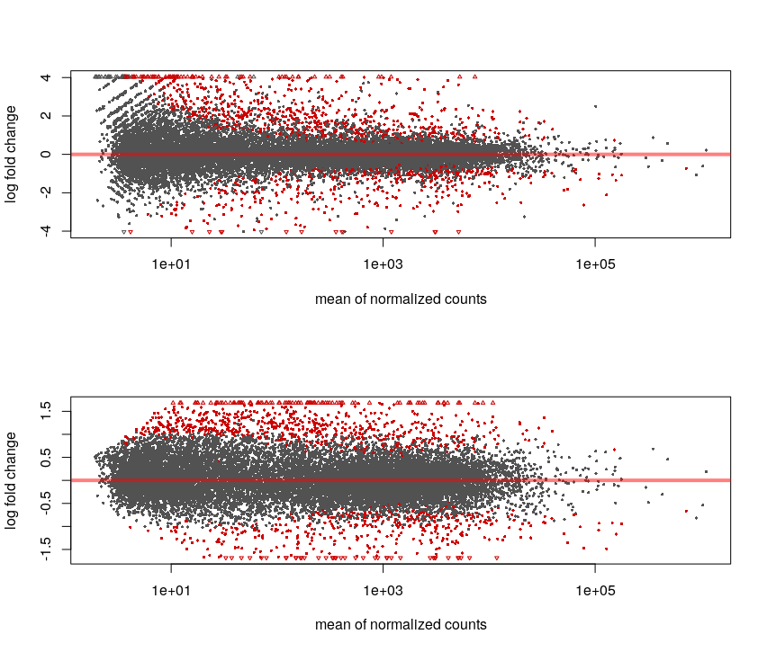
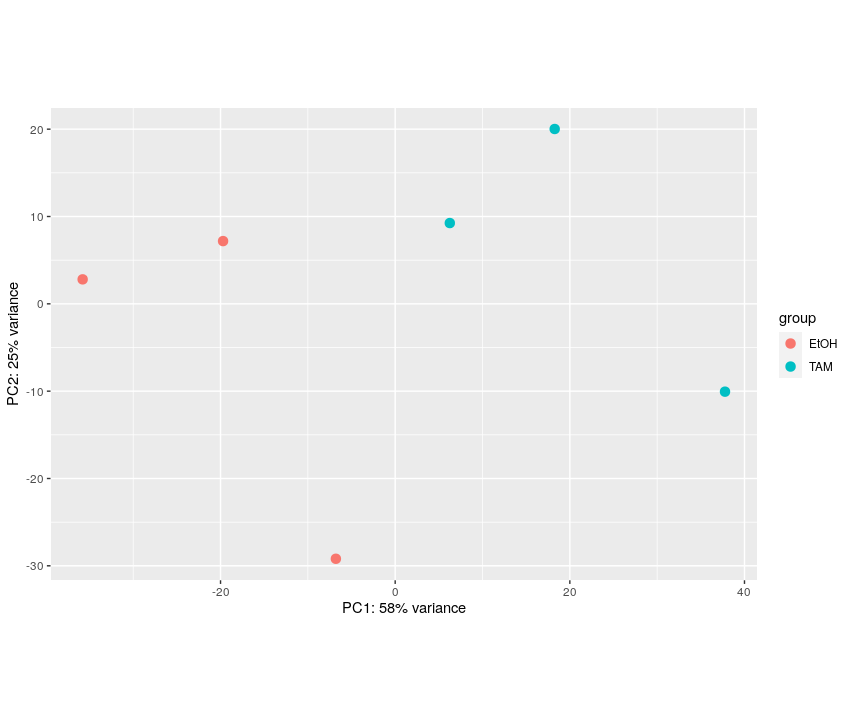
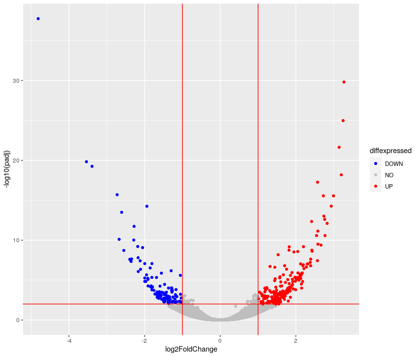
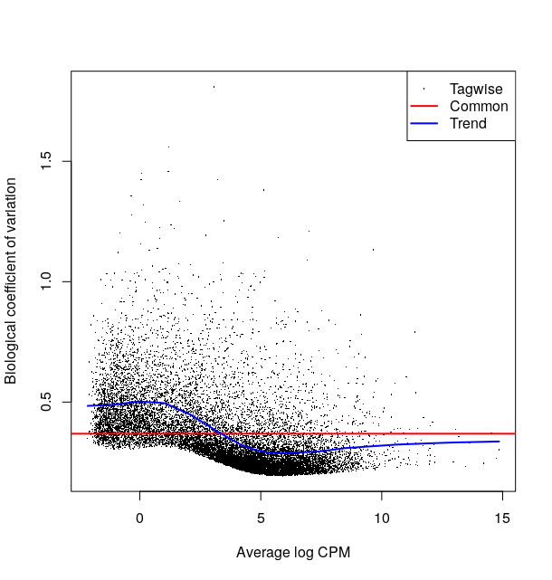
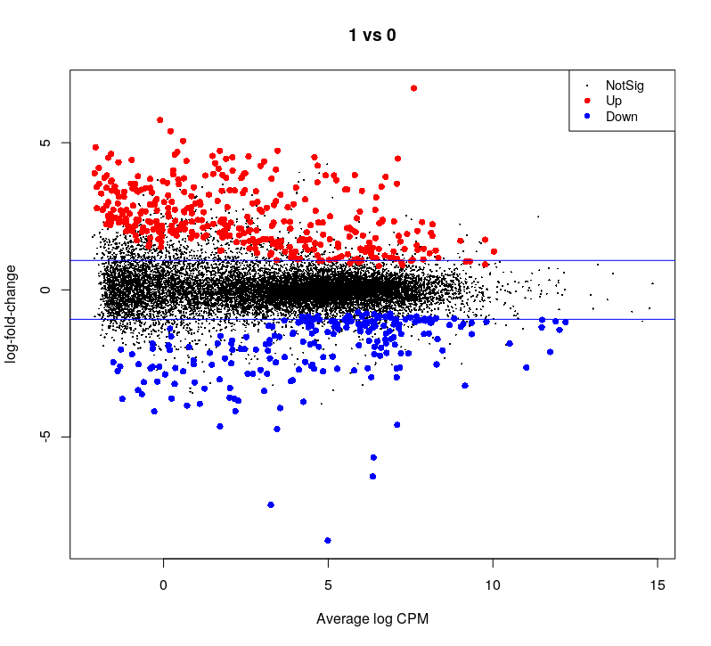
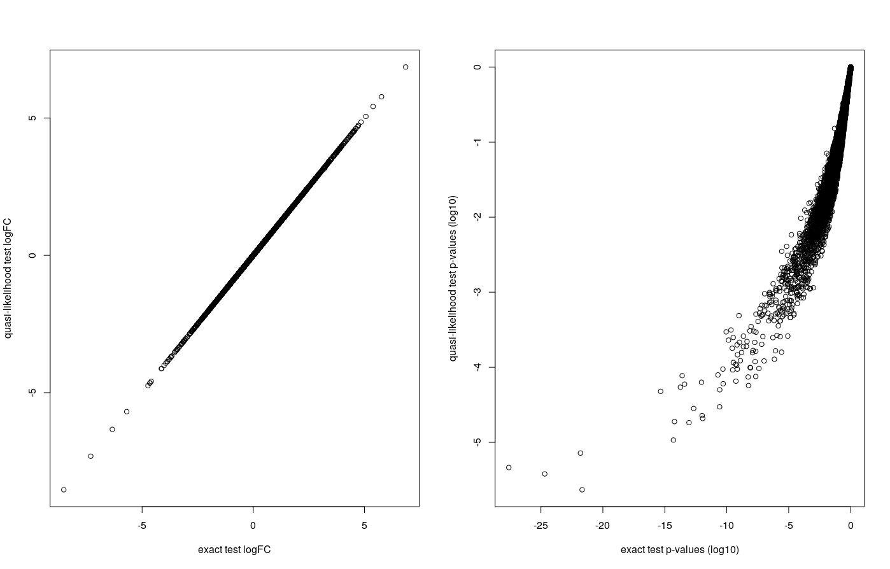

Once the reads have been mapped and counted, one can assess the differential expression of genes between different conditions.


During this lesson, you will learn to:

 * describe the different steps of data normalization and modelization commonly used for RNAseq data
 * detect significantly differentially expressed genes using either edgeR or DESeq2
 * perform downstream analysis to over-representated gene sets (such as GO terms or reactome pathways)


## Material

[:fontawesome-solid-file-pdf: Download the presentation](../assets/pdf/RNA-Seq_06_DE.pdf){: .md-button }

[Rstudio website](https://www.rstudio.com/)

[edgeR user's guide](https://www.bioconductor.org/packages/release/bioc/vignettes/edgeR/inst/doc/edgeRUsersGuide.pdf){: .md-button }

[DESeq2 vignette](https://bioconductor.org/packages/release/bioc/vignettes/DESeq2/inst/doc/DESeq2.html){: .md-button }


## Connexion to the Rstudio server

!!! note
	
	This step is intended only for usrs who attend the course with a teacher. Otherwise you will have to rely on your own installation of Rstudio.


The analysis of the data once reads have been counted will be done on a Rstudio instance, using the language R and some relevant [Bioconductor](http://bioconductor.org/) libraries.

As you start your session on the Rstudio server, please make sure that you know where your data is situated with respect to your **working directory** (use `getwd()` and `setwd()` to respectively : know what your working is, and change it).


## Differential Expression Inference

Use either edgeR or DESeq2 to conduct a differential expression analysis on the Ruhland2016 and/or Liu2015 dataset.

You can find the expression matrices on the server at: `/shared/home/SHARED/Solutions/Ruhland2016/...` and `/shared/home/SHARED/Solutions/Liu2015/`

Or you may download them :

[Liu2015 count matrix](){: .md-button }

[Ruhland2016 count matrix](){: .md-button }

!!! note

	 * Generally, users find the syntax and workflow of DESeq2 easier for getting started
	 * If you have the time, conduct a differential expression analysis using both DESeq2 and edgeR
	 * Follow the vignettes/user's guide! They are the most up-to-date and generally contains everything a newcomer might need, including worked-out examples in the case of edgeR.


### DESeq2

[DESeq2 vignette](https://bioconductor.org/packages/release/bioc/vignettes/DESeq2/inst/doc/DESeq2.html){: .md-button }

??? done "read in the data"
	
	```R
	# setup
	library(DESeq2)
	library(ggplot2)
	
	#setwd("/shared/home/user01/Ruhland2016/")
	
	# reading the counts files - adapt the file path to your situation
	raw_counts <-read.table('.../fC_all.counts' , 
	                        skip=1 , sep="\t" , header=T)
	
	# setting up row names as ensembl gene ids
	row.names(raw_counts) = raw_counts$Geneid
	
	# removing these first columns to keep only the sample counts
	raw_counts = raw_counts[ ,  -1:-6  ] 
	# changing colomn names
	names( raw_counts) = gsub('_.*', '', names(raw_counts) )
	
	# some checking of what we just read
	head(raw_counts); tail(raw_counts); dim(raw_counts)
	colSums(raw_counts) # total number of counted reads per sample
	```

??? done "preprocessing"

	```R
	# setting up the model
	treatment <- c(rep("EtOH",3), rep("TAM",3))
	colData <- data.frame(treatment, row.names = colnames(raw_counts))
	colData
	
	# creating the DESeq data object
	dds <- DESeqDataSetFromMatrix(countData = raw_counts, colData = colData, design = ~ treatment)
	dim(dds)
	
	## filter low count genes . Here the filter is to have at least 2 samples where there is a least 5 reads
	idx <- rowSums(counts(dds, normalized=FALSE) >= 5) >= 2
	dds.f <- dds[idx, ]
	dim(dds.f)
	
	# we go from 46078 to 18010 genes
	```

	Around 18k genes pass our minimum expression threshold.

??? done "estimate dipesersion / model fitting"

	```R
	# we perform the estimation of dispersions 
	dds.f <- DESeq(dds.f)
	
	# we plot the estimate of the dispersions
	# * black dot : raw
	# * red dot : local trend
	# * blue : corrected
	plotDispEsts(dds.f)
	
	# extracting results for the treatment versus control contrast
	res <- results(dds.f)
	```

	

	This plot is not easy to interpret. It represents the amount of dispersion at different levels of expression. It is directly linked to 	our ability to detect differential expression.

	Here it Looks about normal compared to many other RNAseq experiment : the dispersion is comparatively larger for lowly expressed genes.

??? done "looking at the results"

	```R
	# adds estimate of the LFC the results table. 
	# This shrunk logFC estimate is more robust than the raw value
	
	head(coef(dds.f)) # the second column corresponds to the difference between the 2 conditions
	res.lfc <- lfcShrink(dds.f, coef=2, res=res)
	
	#plotting to see the difference.  
	par(mfrow=c(2,1))
	DESeq2::plotMA(res)
	DESeq2::plotMA(res.lfc)
	# -> with shrinkage, the significativeness and logFC are more consistent
	par()
	```

	

	Without the shrinkage, we can see that for low counts we can see a high log-fold change but non significant (ie. we see a large difference but with variance is also so high that this observation may be due to chance only).

	The shrinkage corrects this and the relationshipo between logFC and significance is smoother.


	```R
	# we apply the variance stabilising transformation to make the read counts comparable across libraries
	# (nb : this is not needed for DESeq DE analysis, but rather for the PCA on the data. This replace normal PCA scaling)
	vst.dds.f <- vst(dds.f, blind = FALSE)
	vst.dds.f.counts <- assay(vst.dds.f)
	
	plotPCA(vst.dds.f, intgroup = c("treatment"))
	```
	

	The first axis (58% of the variance) seems linked to the grouping of interest.

	```R
	## Volcano plot
	FDRthreshold = 0.01
	logFCthreshold = 1.0
	# add a column of NAs
	res.lfc$diffexpressed <- "NO"
	# if log2Foldchange > 1 and pvalue < 0.01, set as "UP" 
	res.lfc$diffexpressed[res.lfc$log2FoldChange > logFCthreshold & res.lfc$padj < FDRthreshold] <- "UP"
	# if log2Foldchange < 1 and pvalue < 0.01, set as "DOWN"
	res.lfc$diffexpressed[res.lfc$log2FoldChange < -logFCthreshold & res.lfc$padj < FDRthreshold] <- "DOWN"
	
	ggplot( data = data.frame( res.lfc ) , aes( x=log2FoldChange , y = -log10(padj) , col =diffexpressed ) ) + 
	  geom_point() + 
	  geom_vline(xintercept=c(-logFCthreshold, logFCthreshold), col="red") +
	  geom_hline(yintercept=-log10(FDRthreshold), col="red") +
	  scale_color_manual(values=c("blue", "grey", "red"))
	
	table(res.lfc$diffexpressed)
	```
	```
	 DOWN    NO    UP 
	  125 17647   240 
	```

	
	
	```R
	library(pheatmap)
	topVarGenes <- head(order(rowVars(vst.dds.f.counts), decreasing = TRUE), 20)
	mat  <- vst.dds.f.counts[ topVarGenes, ] #scaled counts of the top genes
	mat  <- mat - rowMeans(mat)  # centering
	pheatmap(mat)
	```
	
	


	```R
	# writing results
	write.csv( res ,'Ruhland2016.DESeq2.results.csv' )
	```


### EdgeR

[edgeR user's guide](https://www.bioconductor.org/packages/release/bioc/vignettes/edgeR/inst/doc/edgeRUsersGuide.pdf){: .md-button }


??? done "read in the data"

	```R
	library(edgeR)
	library(ggplot2)

	# reading the counts files - adapt the file path to your situation
	raw_counts <-read.table('.../fC_all.counts' , 
	           skip=1 , sep="\t" , header=T)
	
	# setting up row names as ensembl gene ids
	row.names(raw_counts) = raw_counts$Geneid
	
	# removing these first columns to keep only the sample counts
	raw_counts = raw_counts[ ,  -1:-6  ] 
	
	# some checking of what we just read
	head(raw_counts); tail(raw_counts); dim(raw_counts)
	colSums(raw_counts) # total number of counted reads per sample

	```

??? done "edgeR object preprocessing"

	```R
	# setting up the model
	#  -> the first 3 samples form an group, the 3 remaining are the other group
	treatment <- c(rep(0,3),rep(1,3))
	dge.f.design <- model.matrix(~ treatment)

	# creating the edgeR DGE object
	dge.all <- DGEList(counts = raw_counts , group = treatment)  

	#filtering by expression level. See ?filterByExpr for details
	keep <- filterByExpr(dge.all)
	dge.f <- dge.all[keep, keep.lib.sizes=FALSE]
	table( keep )
	```

	```
	keep
	FALSE  TRUE 
	30999 15079 
	```

	Around 15k genes are sufficiently expressed to be retained.

	```R
	#normalization
	dge.f <- calcNormFactors(dge.f)
	dge.f$samples
	```

	Each sample has been associated with a normalization factor.

??? done "edgeR model fitting"

	```R
	# estimate of the dispersion
	dge.f <- estimateDisp(dge.f,dge.f.design , robust = T)
	plotBCV(dge.f)
	```
	

	This plot is not easy to interpret. It represents the amount of biological variation at different levels of expression. It is directly linked to our ability to detect differential expression.

	Here it Looks about normal compared to many other RNAseq experiment : the variation is comparatively larger for lowly expressed genes.

	```R
	# testing for differential expression. 
	#This method is recommended whne you only have 2 groups to compare
	dge.f.et <- exactTest(dge.f)
	topTags(dge.f.et) # printing the genes where the p-value of differential expression if the lowest
	```
	```
	Comparison of groups:  1-0 
	                       logFC   logCPM       PValue          FDR
	ENSMUSG00000050272 -8.522762 4.988067 2.554513e-28 3.851950e-24
	ENSMUSG00000075014  3.890079 5.175181 2.036909e-25 1.535728e-21
	ENSMUSG00000009185  3.837786 6.742422 1.553964e-22 7.810743e-19
	ENSMUSG00000075015  3.778523 3.274463 2.106799e-22 7.942107e-19
	ENSMUSG00000028339 -5.692069 6.372980 4.593720e-16 1.385374e-12
	ENSMUSG00000040111 -2.141221 6.771538 4.954522e-15 1.245154e-11
	ENSMUSG00000041695  4.123972 1.668247 6.057909e-15 1.304960e-11
	ENSMUSG00000072941  3.609170 7.080257 1.807618e-14 3.407135e-11
	ENSMUSG00000000120 -6.340146 6.351489 2.507019e-14 4.200371e-11
	ENSMUSG00000034981  3.727969 5.244841 3.934957e-14 5.933521e-11
	```
	```R
	# see how many genes are DE
	summary(decideTests(dge.f.et , p.value = 0.01)) # let's use 0.01 as a threshold
	```
	```
	         1-0
	Down     110
	NotSig 14770
	Up       199
	```

	The comparision is 1-0, so "Up", corresponds to a higher in group 1 (EtOH for us) compared to group 0 (TAM).


??? done "edgeR looking at differentially expressed genes"

	```R
	## plot all the logFCs versus average count size. Significantly DE genes are  colored
	par(mfrow=c(1,1))
	plotMD(dge.f.et)
	# lines at a log2FC of 1/-1, corresponding to a shift in expression of x2 
	abline(h=c(-1,1), col="blue") 
	```

	

	```R	
	## Volcano plot
	allGenes = topTags(dge.f.et , n = nrow(dge.f.et$table) )$table
	
	FDRthreshold = 0.01
	logFCthreshold = 1.0
	# add a column of NAs
	allGenes$diffexpressed <- "NO"
	# if log2Foldchange > 1 and pvalue < 0.01, set as "UP" 
	allGenes$diffexpressed[allGenes$logFC > logFCthreshold & allGenes$FDR < FDRthreshold] <- "UP"
	# if log2Foldchange < 1 and pvalue < 0.01, set as "DOWN"
	allGenes$diffexpressed[allGenes$logFC < -logFCthreshold & allGenes$FDR < FDRthreshold] <- "DOWN"
	
	ggplot( data = allGenes , aes( x=logFC , y = -log10(FDR) , col =diffexpressed ) ) + 
	  geom_point() + 
	  geom_vline(xintercept=c(-logFCthreshold, logFCthreshold), col="red") +
	  geom_hline(yintercept=-log10(FDRthreshold), col="red") +
	  scale_color_manual(values=c("blue", "grey", "red"))
	```
	

	```R
	## writing the table of results
	write.csv( allGenes , 'Ruhland2016.edgeR.results.csv')
	```

??? done "edgeR extra stuff"

	```R
	# how to extract log CPM
	logcpm <- cpm(dge.f, prior.count=2, log=TRUE)

	```


	```R
	# there is another fitting method reliying on quasi likelihood, which is useful when the model is more complex (ie. more than 1 factor with 2 levels)
	dge.f.QLfit <- glmQLFit(dge.f, dge.f.design)
	dge.f.qlt <- glmQLFTest(dge.f.QLfit, coef=2)
	
	# you can see the results relatively different. The order of genes changes a bit, and the p-values are more profoundly affected
	topTags(dge.f.et)
	topTags(dge.f.qlt)
	
	## let's see how much the two methods agree:
	par(mfrow=c(1,2))
	plot( dge.f.et$table$logFC , 
	      dge.f.qlt$table$logFC,
	      xlab = 'exact test logFC',
	      ylab = 'quasi-likelihood test logFC')
	
	print( paste('logFC pearson correlation coefficient :' , 
	             cor(dge.f.et$table$logFC ,dge.f.qlt$table$logFC) ) )
	
	plot( log10(dge.f.et$table$PValue ), 
	      log10(dge.f.qlt$table$PValue) ,
	      xlab = 'exact test p-values (log10)',
	      ylab = 'quasi-likelihood test p-values (log10)')
	
	print( paste( "P-values spearman correlation coefficient",
	              cor( log10(dge.f.et$table$PValue ), log10(dge.f.qlt$table$PValue) , method = 'spearman' )))
	
	```
	
	```
	"logFC pearson correlation coefficient : 0.999997655536736"
	"P-values spearman correlation coefficient 0.993238670517236"
	```

	


	The logFC are highly correlated.
	FDRs show less correlation but their **rank** are higly correlated : they come in a very similar order.


## Downstream analysis : over-representation analysis

Having lists of differentially expressed genes is quite interesting in itself,
however when there is a large number of DE genes it can be interesting to map these results 
onto curated sets of genes associated to biological functions.

We propose here to use [clusterProfiler](https://bioconductor.org/packages/release/bioc/html/clusterProfiler.html),
which regroups several enrichment detection algorithm onto several databases.

We recommend you get inspiration from their very nice [vignette/e-book](http://yulab-smu.top/clusterProfiler-book/) to perform your own analysis.

The proposed correction will concern the results obtained with DESeq2 on the Ruhland2016 dataset.

??? done "analysis with clusterProfiler"

	We being by reading the results of the DE analysis. Adapt this to your own analsysis.
	Beware that edgeR and DESeq2 use different column names in their result tables (log2FoldChange/logFC , padj/FDR).

	```R
	library(AnnotationHub)
	library(AnnotationDbi)
	library(clusterProfiler)
	library(ReactomePA)
	
	library(org.Mm.eg.db)
	
	
	res = read.csv( 'Ruhland2016.DESeq2.results.csv'  , row.names=1)
	#let's define significance as padj <0.01 & abs(lfc) > 1
	res$sig = abs(res$log2FoldChange)>1 & res$padj<0.01
	
	table( res$sig )
	```
	
	Number of non-significant/significant genes 
	
	```
	 FALSE  TRUE 
	 17639   365 
	```
	
	Translating gene ENSEMBL names to their entrezID (this is what clusterProfiler uses), as well as Symbol (named used by most biologist).
	```R
	genes_universe <- bitr(rownames(res), fromType = "ENSEMBL",
	                       toType = c("ENTREZID", "SYMBOL"),
	                       OrgDb = "org.Mm.eg.db")
	
	head( genes_universe )
	#ENSEMBL ENTREZID  SYMBOL
	#2 ENSMUSG00000033845    27395  Mrpl15
	#4 ENSMUSG00000025903    18777  Lypla1
	#5 ENSMUSG00000033813    21399   Tcea1
	#7 ENSMUSG00000002459    58175   Rgs20
	#8 ENSMUSG00000033793   108664 Atp6v1h
	#9 ENSMUSG00000025907    12421  Rb1cc1
	
	dim(genes_universe)
	# 14708     3
	
	length(rownames(dds.f))
	# 18012
	```
	
	```R
	genes_DE <- bitr(rownames(res)[which( res$sig==T )], fromType = "ENSEMBL",
	                 toType = c("ENTREZID", "SYMBOL"),
	                 OrgDb = "org.Mm.eg.db")
	dim(genes_DE)
	# 354   3
	```
	
	```R
	# GO "biological process (BP)" enrichment
	ego_bp <- enrichGO(gene          = as.character(unique(genes_DE$ENTREZID)),
	                   universe      = as.character(unique(genes_universe$ENTREZID)),
	                   OrgDb         = org.Mm.eg.db,
	                   ont           = "BP",
	                   pAdjustMethod = "BH",
	                   pvalueCutoff  = 0.01,
	                   qvalueCutoff  = 0.05,
	                   readable      = TRUE)
	head(ego_bp)
	dotplot(ego_bp, showCategory = 20)
	# sample plot, but with adjusted p-value as x-axis
	#dotplot(ego_bp, x = "p.adjust", showCategory = 20)
	```
	
	
	
	```R
	# Reactome pathways enrichment
	reactome.enrich <- enrichPathway(gene=as.character(unique(genes_DE$ENTREZID)),
	                                 organism = "mouse",
	                                 pAdjustMethod = "BH",
	                                 qvalueCutoff = 0.01,
	                                 readable=T,
	                                 universe = genes_universe$ENTREZID)
	
	
	dotplot(reactome.enrich, x = "p.adjust")
	```
	


## Additionnal : importing counts from salmon with `tximport`

The `tximport` R  packages offers a fairly simple sets of function in order to be able to use the **transcript-level** expression quantifications of salmon or kallisto in a differential **gene** expression analysis.


**Task :** import salmon transcript-level quantification in R in order to perform a DE analysis on it using either edgeR or DESeq2
**Additional:** compare the results with the ones obtained from STAR-aligned reads.

 * The [tximport vignette](https://bioconductor.org/packages/release/bioc/vignettes/tximport/inst/doc/tximport.html) is a very good guide for this task.
 * If you have not computed them, you can find files with expression quantifications in : `/shared/data/...`