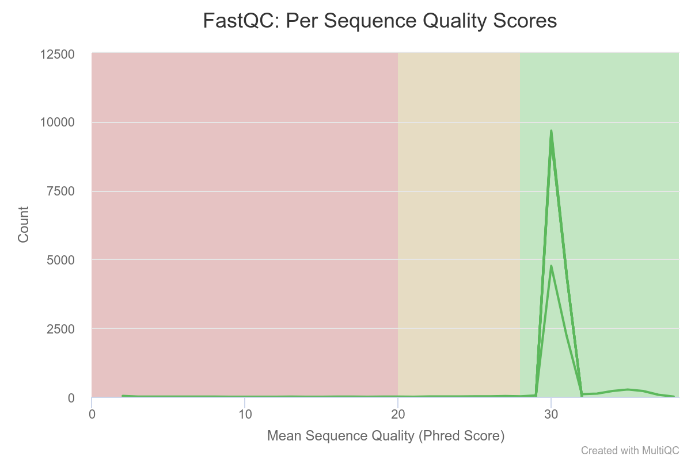
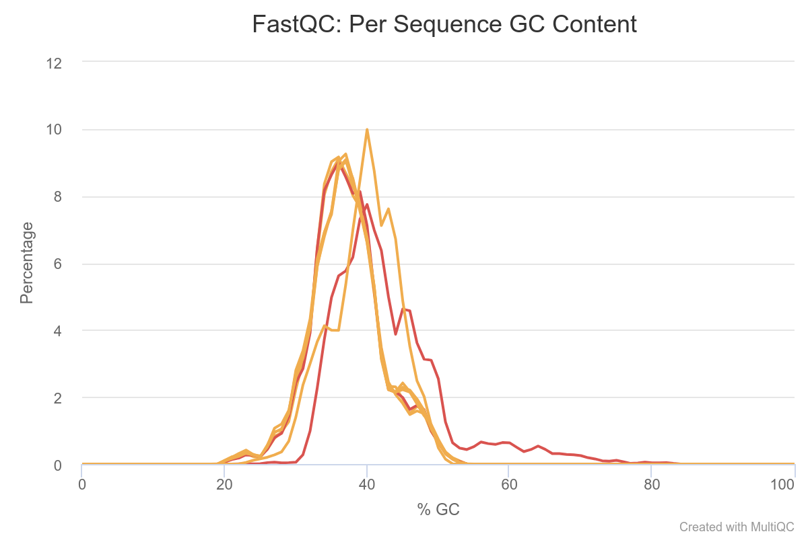
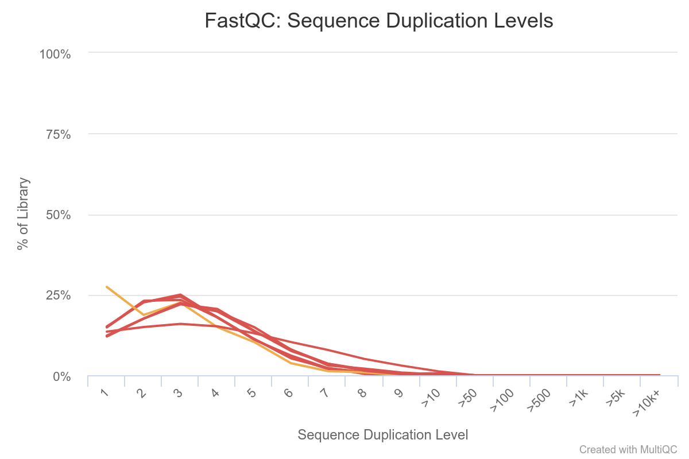
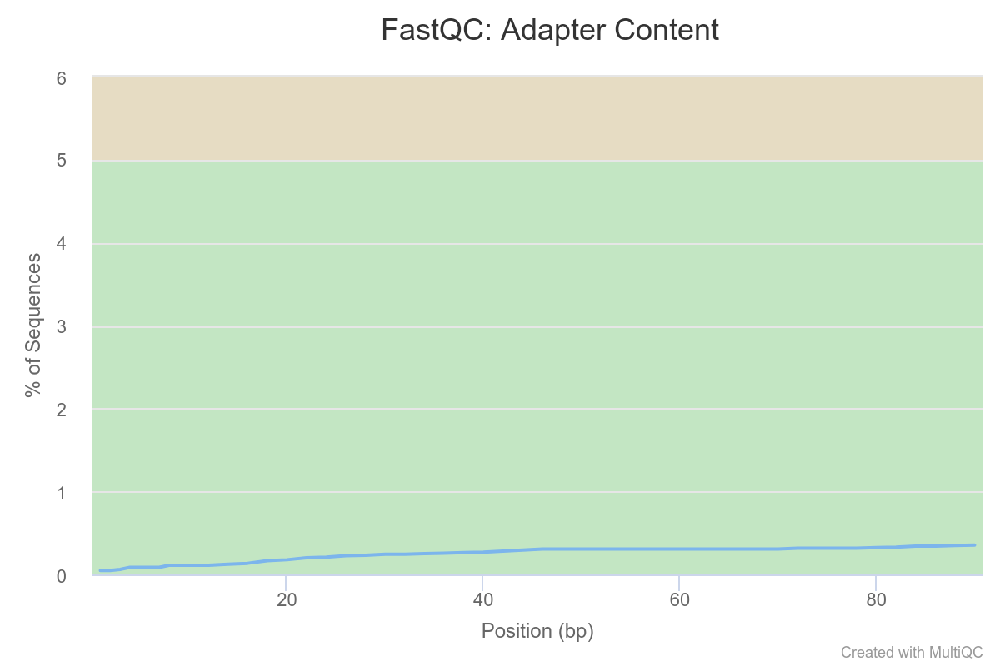
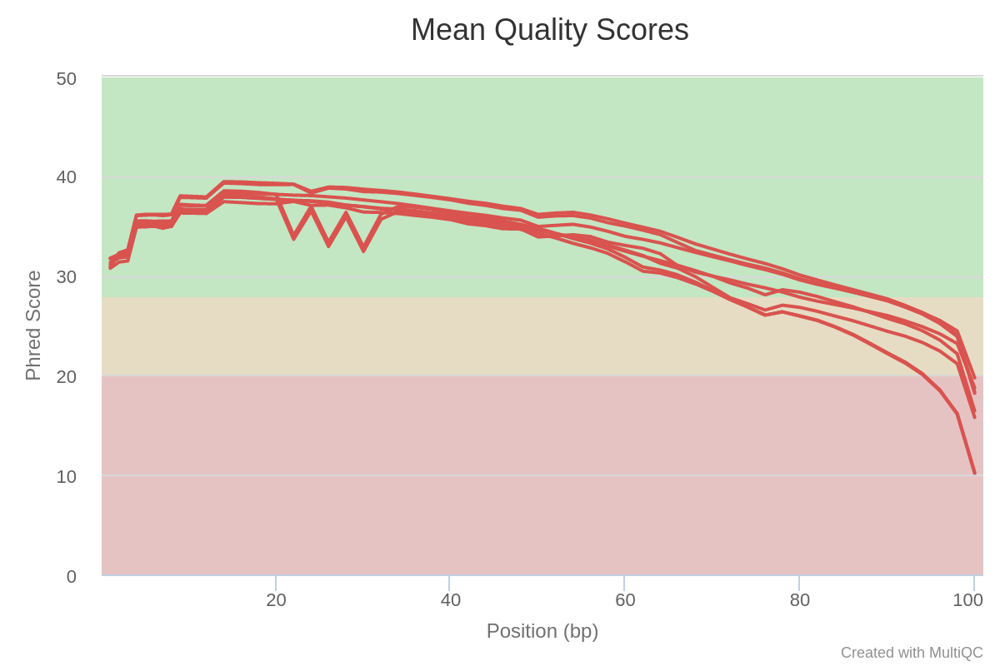
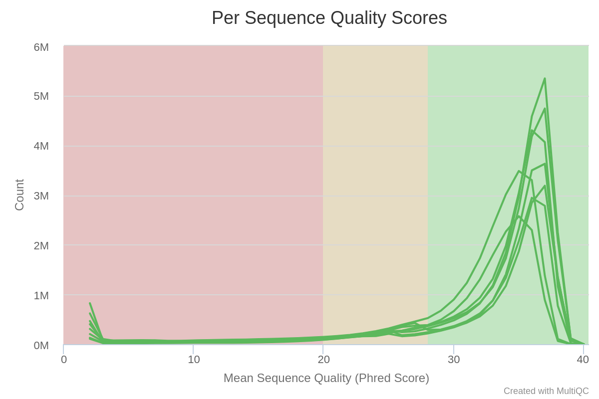
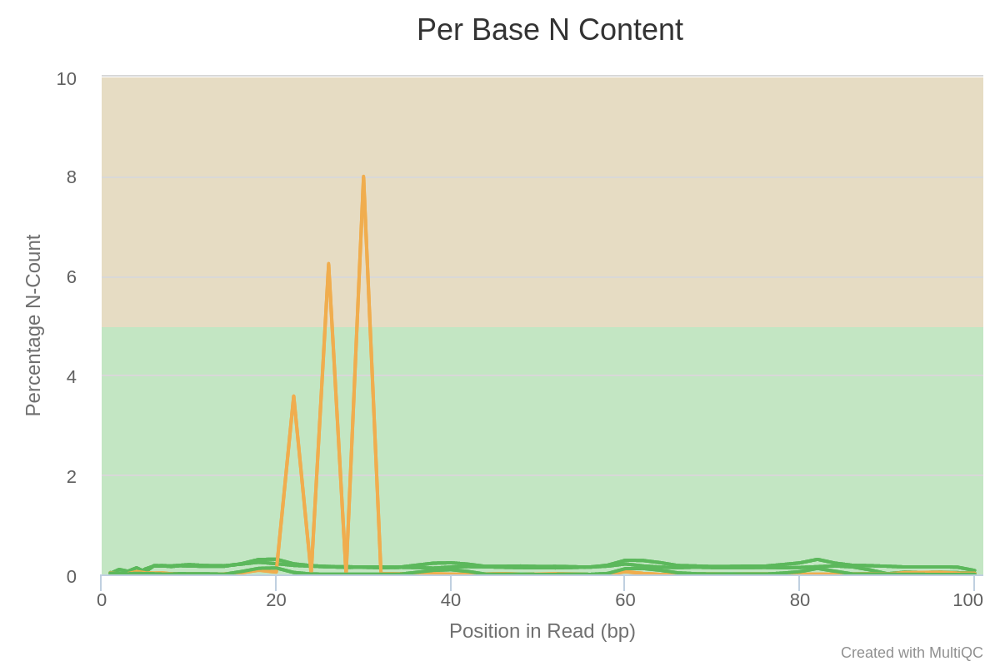
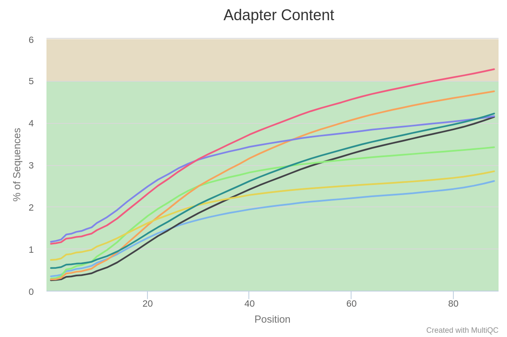
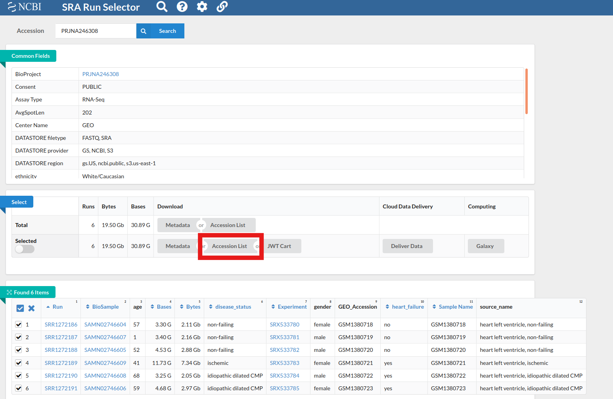

Quality Control is the essential first step to perform once you receive your data from your sequencing facility, typically as `.fastq` or `.fastq.gz` files.


**During this session, you will learn to :**

 * create QC report for a single file with fastqc
 * aggregate multiple QC reports using multiqc
 * interpret the QC reports for an entire RNA-seq experiment


!!! note
	Although we aim to present tools as stable as possible, software evolve and their precise interface can change with time.
	We strongly recommend you consult each command's help page or manual before launching them.
	To this end, we provide links to each tool's website. 

	This can also be useful to you if you are following this course without access to a compute cluster and have to install these tools on your machine.


## Material

[:fontawesome-solid-file-pdf: Download the presentation](../assets/pdf/RNA-Seq_02_QualityControl.pdf){target=_blank : .md-button }

[FastQC website](https://www.bioinformatics.babraham.ac.uk/projects/fastqc/){target=_blank : .md-button }

[MultiQC website](https://multiqc.info/){target=_blank : .md-button }


## Meet the datasets

We will be working with three datasets. The first is a small toy dataset for experimentation, the other two correspond to actual data:

 * toy dataset: RNAseq of mice mitochondrial mRNA
 	* 8 samples : 4 in group A and 4 in group B
 	* single-end, 100bp reads
 	* on the cluster: `/shared/data/DATA/mouseMT/`
 	* [:fontawesome-solid-file-zipper: fastq-files](../assets/zip/toy_dataset_fastq.zip){ .md-button}

 * Liu et al. (2015) “RNA-Seq identifies novel myocardial gene expression signatures of heart failure” Genomics 105(2):83-89 [https://doi.org/10.1016/j.ygeno.2014.12.002](https://doi.org/10.1016/j.ygeno.2014.12.002)
 	* Gene Expression Omnibus id: [GSE57345](https://www.ncbi.nlm.nih.gov/bioproject/?term=GSE57345)
 	* Samples of *Homo sapiens* heart left ventricles : 3 with heart failure, 3 without
 	* paired-end, 100bp reads
 	* on the cluster: `/shared/data/DATA/Liu2015/`

 * Ruhland et al. (2016) “Stromal senescence establishes an immunosuppressive microenvironment that drives tumorigenesis” Nature Communications 7:11762 [https://dx.doi.org/10.1038/ncomms11762](https://dx.doi.org/10.1038/ncomms11762)
 	* Gene Expression Omnibus id: [GSE78128](https://www.ncbi.nlm.nih.gov/geo/query/acc.cgi?acc=GSE78128)
 	* Samples of *Mus musculus* skin fibroblasts : 3 non-senescent (EtOH), 3 senescent (TAM)
 	* single-end, 50bp reads
 	* on the cluster: `/shared/data/DATA/Ruhland2016/`


## FastQC : a report for a single fastq file

[FastQC](https://www.bioinformatics.babraham.ac.uk/projects/fastqc/) is a nice tool to get a variety of QC measures from files such as `.fastq`, `.bam` or `.sam` files. 

Although it has many options, the default parameters are often enough for our purpose :

```sh
fastqc -o <output_directory> file1.fastq file2.fastq ... fileN.fastq
```

FastQC is reasonably intelligent, and will try to recognise the file format and uncompress it if necessary (so no need to decompress manually).


So, let's apply fastQC to the toy dataset. 


**Task:** 

On the cluster, in the folder `day1`, create a new folder `mouseMT` and enter it.

```sh
mkdir mouseMT
cd mouseMT
```

Then, create here a new text file name `010_fastqc.sh` (with `nano`, or on your local computer ), and paste the following content in it:

```sh
#!/usr/bin/bash
#SBATCH --job-name=fastqc
#SBATCH --time=01:00:00
#SBATCH --cpus-per-task=1
#SBATCH --mem=1G
#SBATCH -o fastqc_mouseMT.o

ml fastqc

# creating the output folder
mkdir -p 010_fastqc/

fastqc -o 010_fastqc /shared/data/DATA/mouseMT/*.fastq
```

Save it, and then submit it to the cluster:

```sh
sbatch 010_fastqc.sh
```

Monitor it with `squeue`. It should take around 15 to 30 seconds in total.

Once it has run, look at the content of the job output file, `fastqc_mouseMT.o`.

Check that all analysis were complete and that there were no error.

You can also check that the `010_fastqc/` folder contains several html files:

```sh
ls 010_fastqc/
```

output:
```sh
sample_a1_fastqc.html  sample_a2_fastqc.html  sample_a3_fastqc.html  sample_a4_fastqc.html  sample_b1_fastqc.html  sample_b2_fastqc.html  sample_b3_fastqc.html  sample_b4_fastqc.html
sample_a1_fastqc.zip   sample_a2_fastqc.zip   sample_a3_fastqc.zip   sample_a4_fastqc.zip   sample_b1_fastqc.zip   sample_b2_fastqc.zip   sample_b3_fastqc.zip   sample_b4_fastqc.zip
```

Unfortunately, we cannot consult the html files content directly on the cluster. 

We will look at one of these html report on the toy dataset, and one of the pre-computed report from one of our other datasets.

 * repatriate one of the html report of the mouseMT dataset to your local computer, as well as the one you can find in:
`/shared/data/Solution/Liu2015/010_fastqc/SRR3180538_TAM1_1_fastqc.html`
 * Look at these two QC reports in a web browser. What are your conclusions ? Would you want to perform some operations on the reads, such as low-quality bases trimming, removal of adapters ?

!!! note "Reminder"

	 to get the data from the distant server to your machine, you may use an SFTP client (FileZilla, mobaXterm), or the command line tool from your machine :	`scp login@xx.xx.xx:~/path/to/file.txt .`


**Extra Task:** 

 * Write one or more slurm-compatible sbatch scripts in your home directory that run FastQC analysis on each FASTQ file from the Liu2015 and Ruhland216 datasets. These are accessible at : `/shared/data/DATA/Liu2015/` and `/shared/data/DATA/Ruhland2016/`. 

!!! Warning

    Make sure your script writes the fastqc output to a folder within your own home directory.


!!! info "Important points"

     * FastQC RAM requirements : 1Gb is more than enough.
     * FastQC time requirements : ~ 5min / read file.
     * try to make sure FastQC outputs all reports in the same directory, this will save time for the next step ;-).
     * in your script, don't forget to load fastqc : `ml fastqc`.
     * there is no need to copy the read files to your home directory (in fact, it is good practice not to: it would create data redundancy, and we won't have enough space left on the disk anyway...).


??? success "Liu2015 FastQC sbatch script"

	```sh
	#!/usr/bin/bash
	#SBATCH --job-name=fastqc
	#SBATCH --time=01:00:00
	#SBATCH --cpus-per-task=1
	#SBATCH --mem=1G
	#SBATCH -o fastqc_Liu2015.o

	ml fastqc

	# creating the output folder
	mkdir -p 010_fastqc/

	fastqc -o 010_fastqc /shared/data/DATA/Liu2015/*.fastq.gz
	```

	on the cluster, this script is also in `/shared/data/Solutions/Liu2015/010_fastqc.sh`


  This script runs fastqc on each of the .fastq.gz files, sequentially.
	Note that alternatively, you could have one sbatch script per sample.
	On a simple and relatively fast task such as this one, it is not too problematic.
	However, on more computationally-intensive tasks such as mapping, treating each file in separate script is better, because you can submit all scripts at once, and they will then run in parallel, whereas if they are all treated in the same script like here, the samples would be handled sequentially and the overall job would take much longer to finish.

	**NB:** BUT, the actual recommended approach is to use SLURM arrays, which let you have a single script, but have different jobs execute in parallel. Below, we show how to do this.


??? success "Ruhland2016 FastQC sbatch script"

	```sh
	#!/usr/bin/bash
	#SBATCH --job-name=fastqc
	#SBATCH --time=00:30:00
	#SBATCH --cpus-per-task=1
	#SBATCH --mem=1G
	#SBATCH -o fastqc_Ruhland2016.o

	ml fastqc

	mkdir -p 010_fastqc/

	fastqc -o 010_fastqc /shared/data/DATA/Ruhland2016/*.fastq.gz
	```

	on the cluster, this script is also in `/shared/data/Solutions/Ruhland2016/010_fastqc.sh`


??? success "Alternative sbatch script using array job"
  
	Here is a solution where all files from a same dataset can be processed in parallel (recommended) by using slurm array jobs.
  
	First, have a file named `Ruhland2016.fastqFiles.txt` containing the sample fastq file names :

	```
	SRR3180535_EtOH1_1.fastq.gz
	SRR3180536_EtOH2_1.fastq.gz
	SRR3180537_EtOH3_1.fastq.gz
	SRR3180538_TAM1_1.fastq.gz
	SRR3180539_TAM2_1.fastq.gz
	SRR3180540_TAM3_1.fastq.gz
	```

	Then, in the same folder, you can create this sbatch script :

	```sh
	#!/usr/bin/bash
	#SBATCH --job-name=fastqc
	#SBATCH --time=00:30:00
	#SBATCH --cpus-per-task=1
	#SBATCH --mem=1G
	#SBATCH -o fastqc_Ruhland2016.%a.o
	#SBATCH -e fastqc_Ruhland2016.%a.e
	#SBATCH --array 1-6%6

	ml fastqc

	dataDir=/shared/data/DATA/Ruhland2016
	
	sourceFILE=Ruhland2016.fastqFiles.txt
	
	## retrieving 1 filename from Ruhland2016.fastqFiles.txt
	fastqFILE=`sed -n ${SLURM_ARRAY_TASK_ID}p $sourceFILE`
	
	mkdir -p 010_fastqc/
	fastqc -o 010_fastqc/ $dataDir/$fastqFILE
	```

	When submitted with `sbatch`, this script will spawn 6 tasks in parallel, each with a different value of `${SLURM_ARRAY_TASK_ID}`.

	This is the recommended option : this allows you to launch all your job in parallel with a single script.


??? success "Interpretation of a report"

	[:fontawesome-solid-file-pdf: Download an annotated report](../assets/pdf/SRR3180535_EtOH1_1_fastqc.pdf){ .md-button}

	We also refer you to this [nice interpertation guide](https://hbctraining.github.io/Intro-to-rnaseq-hpc-salmon/lessons/qc_fastqc_assessment.html)

	Pre-computed reports can be found in :

	 * `/shared/data/Solutions/Ruhland2016/010_fastqc/`
	 * `/shared/data/Solutions/Liu2015/010_fastqc/`
	 * `/shared/data/Solutions/mouseMT/010_fastqc/`


## MultiQC : grouping multiple reports

In practice, you likely will have more than a couple of samples (maybe even more than 30 or 50...) to handle: individually consulting and comparing the QC reports of each would be tedious.

[MultiQC](https://multiqc.info/) is a tool that lets you combine multiple reports in a single, interactive document that let you explore your data easily.

Here, we will be focusing on grouping FastQC reports, but MultiQC can also be applied to the output or logs of other bioinformatics tools, such as mappers, as we will see later.

In its default usage, `multiqc` only needs to be provided a path where it will find all the individual reports, and it will scan them and write a report named `multiqc_report.html`.

Although the default behaviour is quite appropriate, with a couple of options we get a slightly better control over the output:

 * `--interactive` : forces the plot to be interactive even when there is a lot of samples (this option can lead to larger html files).
 * `-n <filename>` : specify the name of the output file name.

For instance, a possible command line could be :
```sh
multiqc -n <output_file.html> --interactive <fastqc reports folder>/
```

There are many additional parameters which let you customize your report. Use `multiqc --help` or visit their [documentation webpage](https://multiqc.info/docs/#running-multiqc) to learn more.


**Task:** 

 - Write an sbatch script to run MultiQC for the toy dataset.

 	 To follow the naming convention we started with, you can use the following names:

     * sbatch script: `020_multiqc.sh` 
     * output report: `020_multiqc_mouseMT.html`

 - Look at the generated html report. What are your conclusions ?

!!! info
     * MultiQC RAM requirements : 1Gb should be more than enough.
     * MultiQC time requirements : ~ 1min / read file.
     * Exceptionally, there is no need to load multiqc as a module (it is not part of ComputeCanada and we installed it directly on the cluster, on other clusters it may not be the same).
     * Use `multiqc --help` to check the different options


??? success "mouseMT MultiQC sbatch script"

	```sh
	#!/usr/bin/bash
	#SBATCH --job-name=multiqc
	#SBATCH --time=00:30:00
	#SBATCH --cpus-per-task=1
	#SBATCH --mem=1G
	#SBATCH -o multiqc_mouseMT.o
	
	multiqc -n 020_multiqc_mouseMT.html -f --title raw_fastq 010_fastqc/
	```
	On the cluster, this script is also in `/shared/data/Solutions/mouseMT/020_multiqc.sh`

	[:fontawesome-solid-file-pdf: Download the results of this script](../assets/html/020_multiqc_mouseMT.html){ .md-button}


??? success "Interpretation of the report for the mouseMT data."

	

	The PHRED quality of reads drop below 30 around base 75. All samples seem affected. One sample seems to stand out a bit

	

	Mean quality scores are on average fairly high.

	

	Most samples do not deviate too much, Except for two samples which clearly contains more GC% rich content compared to the other samples.
	This may be indicative of contamination or just a difference in composition.

	

	Here we see that some sequences are duplicated, but not many.
	Normally in the context of RNA-seq, some transcripts are present in a large number of copies in the samples, so we would expect to see more over-represented sequences. 
	This is not the case here because this is a toy dataset with a very small number of reads.

	

	We see a clear trend of adapter contamination for one sample as we get closer to the reads' end. Note the y-scale though : we never go above a 6% content per sample.


	Overall, we can conclude that one sample in particular stands out. 

	We should note its name and monitor it closely as we go through the rest of our analysis pipeline.

	At the moment, the analysis steps are independent from sample to sample, so keeping that potential outlier is not a problem. However, when we come to differential analysis we will have to decide if we keep this sample or exclude it.


??? success "Interpretation of the report for the Liu2015 data."

	We will interpret the report for the Liu2015 data.

	[:fontawesome-solid-file-pdf: Download the report](../assets/html/020_multiqc_mouseLiu2015.html){ .md-button}

	

	The PHRED quality of reads drop below 30 around base 75. All samples seem affected. One sample seems to have some quality drops at specific timepoints/positions.

	

	Mean quality scores are on average fairly high, but some reads exhibit low values.

	

	Most samples do not deviate too much from the expected curve. The two samples colored in orange and red have a mode for a very specific value.
	This may be indicative of contamination, retaining specific rRNA, or adapter sequence content.

	

	Ns are present at specific positions in specific samples, in particular for one sample. This is reminiscent of the PHRED quality curves at the top of the report.
	It seems some flowcells had a problem at specific time-point/positions.

	

	This is colored red because this would be a problem if the data was coming from genomic DNA sequencing.
	However here we are in the context of RNA-seq : some transcripts are present in a large number of copies in the samples, and consequently it is expected that some sequences are over-represented.


	

	We see a clear trend of adapter contamination as we get closer to the reads' end. Note the y-scale though : we never go above a 6% content per sample.


	Overall, we can conclude that these samples all suffer from some adapter content and a lower quality toward the reads' second half. Furthermore, a few samples have a peculiar N pattern between bases 20 and 30.

	It is then strongly advised to either :

	 * perform some trimming : remove adapter sequences + cut reads when average quality becomes too low
	 * use a mapper that takes base quality in account AND is able to ignore adapter sequence (and even then, you could try mapping on both trimmed and untrimmed data to see which is the best)


**extra Task**

Write and execute sbatch scripts to run a MultiQC for the Liu2015 and the Ruhland2016 datasets.


??? success "MultiQC sbatch script for Ruhland2016"

	This script fetches the report from the `Solutions/` folder.

	You may adapt it to point to your own results if you want.

	```sh
	#!/usr/bin/bash
	#SBATCH --job-name=multiqc_Ruhland2016
	#SBATCH --time=00:30:00
	#SBATCH --cpus-per-task=1
	#SBATCH --mem=1G
	#SBATCH -o multiqc_Ruhland2016.o
	
	multiqc -f 020_multiqc_Ruhland2016.html /shared/data/Solutions/Ruhland2016/010_fastqc/
	```
  On the cluster, this script is also in `/shared/data/Solutions/Ruhland2016/020_multiqc.sh`


??? done "MultiQC sbatch script for Liu2015"

	This script fetches the report from the `Solutions/` folder.

	You may adapt it to point to your own results if you want.

	```sh
	#!/usr/bin/bash
	#SBATCH --job-name=multiqc_Liu2015
	#SBATCH --time=00:30:00
	#SBATCH --cpus-per-task=1
	#SBATCH --mem=1G
	#SBATCH -o multiqc_Liu2015.o
	
	multiqc -f 020_multiqc_Liu2015.html /shared/data/Solutions/Liu2015/010_fastqc/
	```

	On the cluster, this script is also in `/shared/data/Solutions/Liu2015/020_multiqc.sh`


## EXTRA : retrieving published datasets

!!! note
	If you are following this course with a teacher, then the data is already on the server. There is no need to download it again.

Most NGS data is deposited at the [Short Read Archive (SRA)](https://www.ncbi.nlm.nih.gov/sra/) hosted by the NCBI, with links from the [Gene Expression Omnibus (GEO)](https://www.ncbi.nlm.nih.gov/geo/)


 Several steps are required to retrieve data from a published study :
	
 1. find GEO or SRA identifier from publication(s).
 2. find the “run” identifiers for each sample (SRR).
 3. use [SRA Toolkit](https://github.com/ncbi/sra-tools/wiki/01.-Downloading-SRA-Toolkit) to dump data from the SRR repository to FASTQ files.


For example, on the Liu2015 dataset :


 1. Locate the GEO accession in their publication: GSE57345 
 2. Use the NCBI search engine to find this accession : [GSE57345](https://www.ncbi.nlm.nih.gov/bioproject/?term=GSE57345)
 3. This project is made of several sub-projects. Scroll down, and in the table find the Bioproject id : PRJNA246308 
 4. Go to the [SRA run selector](https://trace.ncbi.nlm.nih.gov/Traces/study/?acc=PRJNA246308&o=acc_s%3Aa), enter the Bioproject id
 5. From the [results of your search](https://trace.ncbi.nlm.nih.gov/Traces/study/?acc=PRJNA246308&o=acc_s%3Aa), select all relevant runs
 6. Click on "Accession List" in the Select table 




 7. use `fastq-dump` (part of the [SRA Toolkit](https://github.com/ncbi/sra-tools/wiki/01.-Downloading-SRA-Toolkit)) on the downloaded accession list. For example, with a very small dataset (45Mb only, but already, this can take about a minute):

 `fastq-dump --gzip --skip-technical --readids --split-files --clip SRR306383`


!!! note
	 * `fastq-dump` takes a very long time
	 * You’ll need to know the nature of the dataset (library type, paired vs single end, etc.) before analysing it.
	 * [More information about fastq-dump](https://edwards.sdsu.edu/research/fastq-dump/)

